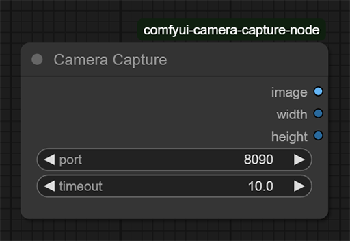

<h1 align="center">Camera Capture</h1>

|                                                                  🌟                                                                   |                  Support this project                   |               
|:-------------------------------------------------------------------------------------------------------------------------------------:|:-------------------------------------------------------:|
|    | <code>bc1qs6qq0fkqqhp4whwq8u8zc5egprakvqxewr5pmx</code> | 
|  | <code>0x3147bEE3179Df0f6a0852044BFe3C59086072e12</code> |
|     |     <code>TKznmR65yhPt5qmYCML4tNSWFeeUkgYSEV</code>     |

This is a project that provides the ability to take pictures with a smartphone camera and use them in the ComfyUI workflow

The project consists of two parts:
 
<a href="https://github.com/numq/comfyui-camera-capture-node">ComfyUI node 📍</a>
and
<a href="https://github.com/numq/camera-capture">mobile application</a>

## 📖 Table of Content

* [📱 Supported platforms](#-supported-platforms)
* [✨ Features](#-features)
* [🔧 How does it work?](#-how-does-it-work)
* [📦 Installation](#-installation)
* [🎯 Usage](#-usage)
* [🔗 Links](#-links)

# 📱 Supported platforms

| Platform | Minimal Version | Availability |
|:--------:|:---------------:|:------------:|
| Android  |  8.0 (SDK 28)   |      ✅       |
|   iOS    |        -        |      ❌       |

# ✨ Features

## Android

- Configure `port` (default: 8090)
- Turn `flashlight` on/off
- Switch camera `lens facing`

## ComfyUI node:

- Configure `port` (default: 8090)
- Configure `timeout` (default: 10 seconds)
- Get output as `image`, `width`, `height`

# 🔧 How does it work?

## Android

The application consists of two parts: a camera for capturing images and an HTTP server.
When a request is received, the server captures an image from the camera and returns it in JSON format.

## ComfyUI node

The node performs port forwarding using [adb](https://developer.android.com/tools/adb), which allows you to connect to
the server on your USB-connected
smartphone
via localhost.
When the node is executed, an HTTP client is created that sends a request to the server running on the smartphone and
then receives a response with a JSON file containing the image, its width and height.

# 📦 Installation

Install [adb](https://developer.android.com/tools/adb) on your computer. Make sure it is set in environment variables
and can be called in command line

## Android

Install the [Camera Capture](https://github.com/numq/camera-capture) application, which allows you to
capture images from your smartphone camera

## ComfyUI node

Clone [comfyui-camera-capture-node](https://github.com/numq/comfyui-camera-capture-node) repository into your
`./ComfyUI/custom_nodes` folder, or download the latest release and place the `comfyui-camera-capture-node` folder
there

# 🎯 Usage

> [!IMPORTANT]
> Make sure the port of the client and server match

## Android

1. Connect your smartphone to your PC via USB
2. Launch the `Camera Capture` application
3. Grant permission to use the smartphone camera
4. If you see a preview of the camera, it is working
5. Change the port if necessary
6. Establish a connection to the server, making sure that it has a `Connected` state

## ComfyUI node

1. Find the category `camera`
2. Add a node `Camera Capture` to the workflow
3. Run the workflow
4. If you get a black 512x512 image, check the console for an error

# 🔗 Links

- [ComfyUI](https://www.comfy.org/)
- [adb](https://developer.android.com/tools/adb)
- [Camera Capture](https://github.com/numq/camera-capture)
- [comfyui-camera-capture-node](https://github.com/numq/comfyui-camera-capture-node)